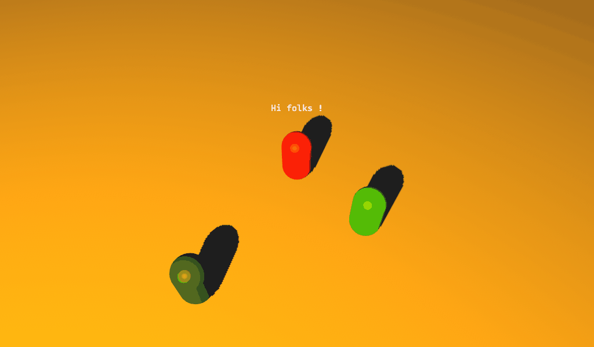
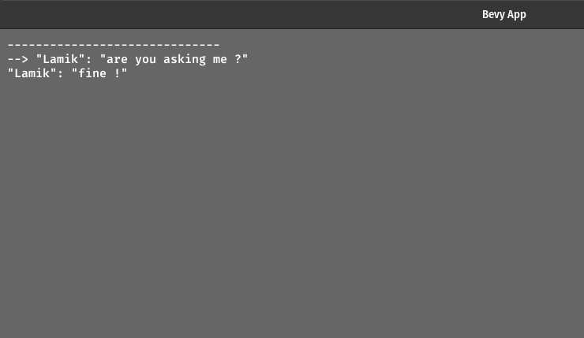
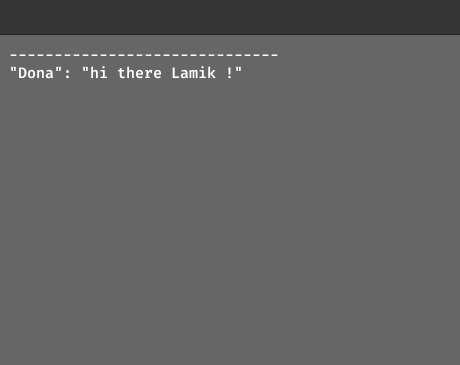

<div align="center">
<h1>
    Bevy_mod_yarn
</h1>


</div>

Parser + helpers for the [YarnSpinner](https://github.com/YarnSpinnerTool/YarnSpinner) dialogue file format for the [Bevy Engine](https://github.com/bevyengine/bevy)
To be able to create narrative games and more in Bevy !


This projets is still in the early stages, but it is already useable as it is for some basic Yarn scripts.

Since I am using it myself and will be relying on it heavilly (yeah for dogfooding), 

I am aiming to be able to parse & support as much of the Yarn Syntax as possible.


## Usage

Here's a minimal usage example:

```toml
# Cargo.toml
[dependencies]
bevy_mod_yarn = { git = "https://github.com/kaosat-dev/bevy_mod_yarn", branch = "main" }
```

```rust no_run
use bevy::prelude::*;
use bevy_mod_yarn::prelude::*;

fn main() {
    App::new()
        .add_plugins(DefaultPlugins)
        .add_plugin(YarnPlugin)
        .init_resource::<State>() // only needed for manual loading

        .add_startup_system(setup)
        .add_system(dialogue_init)
        .add_system(dialogue_navigation)
        .run();
}

// only needed for manual loading, not when using tools like [bevy_asset_loader](https://github.com/NiklasEi/bevy_asset_loader)
#[derive(Resource, Default)]
struct State {
    handle: Handle<YarnAsset>,
    done: bool
}

fn setup(
    mut state: ResMut<State>, 
    asset_server: Res<AssetServer>, 
    mut commands: bevy::prelude::Commands
) {
    // load the yarn dialogue file
    state.handle = asset_server.load("dialogues/single_node_simple.yarn");
}

fn dialogue_init(mut state: ResMut<State>, dialogues: Res<Assets<YarnAsset>>, mut commands: bevy::prelude::Commands) {
    if let Some(dialogues)= dialogues.get(&state.handle) {
        if !state.done {
            commands.spawn(
                DialogueRunner::new(dialogues.clone(), "Start")
            );
            state.done = true;
        }
    }
}

fn dialogue_navigation(
    keys: Res<Input<KeyCode>>,
    mut runners: Query<&mut DialogueRunner>,
) {
    if let Ok(mut runner) = runners.get_single_mut() {
        if keys.just_pressed(KeyCode::Return) {
            runner.next_entry();
        }
        if keys.just_pressed(KeyCode::Down) {
            runner.next_choice()
        }
        if keys.just_pressed(KeyCode::Up) {
            runner.prev_choice()
        }
    }
}

```
this is taken from the 'basic' [example](./examples//basic/basic.rs)

see the examples below for more details , how to display your dialogues etc

## Examples

This crate provides different examples for different features/ways to use within Bevy

### [Basic](./examples/basic)

- simplest possible usage

    

    run it with 
    
    ```cargo run --example basic```

### [Commands](./examples/commands)

- using `Yarn` commands with Bevy systems to play audio files during the dialogue flow

    

    run it with 
    
    ```cargo run --example command```

### [Portraits](./examples/portraits)

- a barebones "old school rpg dialogue with Character portraits" 

    

    run it with 
    
    ```cargo run --example portraits```

### [Bubbles](./examples/bubbles)

- a barebones "speech bubbles" (ok, just text, but still :) over characters heads in 3D 

    

    run it with 
    
    ```cargo run --example bubbles```

## Development status

- [x] basic nodes parsing (header + body)
- [x] dialogues: with or without character names
- [x] choices/ options: blank line to close a list of choices
- [x] choices/ options: nested/ indentation handling 
- [x] commands: basic parsing & handling
- [x] tags parsing
- [ ] tags available inside statements 
- [ ] expressions parsing
- [ ] conditional expressions
- [ ] dialogues: conditional branching with expressions
- [ ] dialogues: interpolated values
- [ ] dialogues: attributes


I will put it on crates.io once I feel it is useable enough.

## What this tool does:

- provide a [parser](./src/parser/) (written with Nom). Not specific to Bevy, will likely be extracted into its own Crate down the line.
- provide an [asset loader](./src/yarn_loader.rs) for Bevy
- provide a [plugin](./src/lib.rs) for Bevy

- some additional data structures and functions to deal with the Yarn Format inside bevy, in a minimalistic manner

## What this tool does not:

- provide complex UI or predefined ways to interact with the dialogues inside Bevy, for a few reasons
    * Bevy's UI is still constantly evolving
    * Other UI tools for Bevy are very promising, like [Belly](https://github.com/jkb0o/belly), [Kayak](https://github.com/StarArawn/kayak_ui) or [Egui](https://github.com/mvlabat/bevy_egui), they are not "standard" however
    * everyone has their preferences
- you will find some varied examples for use with Bevy to get you started 

## License

Dual-licensed under either of

- Apache License, Version 2.0, ([LICENSE-APACHE](/LICENSE_APACHE) or https://www.apache.org/licenses/LICENSE-2.0)
- MIT license ([LICENSE-MIT](/LICENSE_MIT) or https://opensource.org/licenses/MIT)

at your option.


## Compatible Bevy versions

The main branch is compatible with the latest Bevy release (0.10.1), while the branch `bevy_main` tries to track the `main` branch of Bevy (not started yet, PRs updating the tracked commit are welcome).

Compatibility of `bevy_mod_yarn` versions:
| `bevy_mod_yarn`     | `bevy` |
| :--                 |  :--   |
| `0.1`               | `0.10.1` |
| `main`              | `0.10.1` |
| `bevy_main`         | `main` |


## Contribution

Unless you explicitly state otherwise, any contribution intentionally submitted
for inclusion in the work by you, as defined in the Apache-2.0 license, shall be dual licensed as above, without any
additional terms or conditions.


[bevy]: https://bevyengine.org/